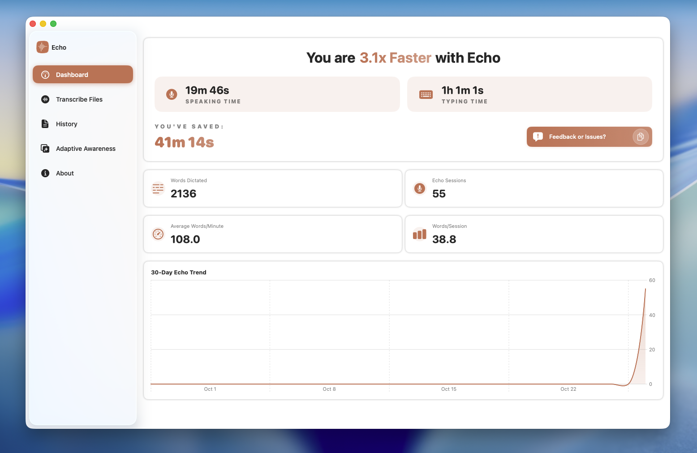
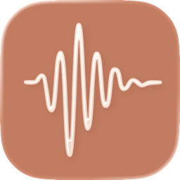

  

  

  

  <h1>Embr Voice</h1>

  
<strong>Speak naturally. See your words instantly. Completely private.</strong>

  

    
    
  

  

    
  

  

    <a href="https://embr.sh">Website</a> •
    <a href="#get-started">Get Started</a> •
    <a href="#what-you-can-do">Features</a> •
    <a href="BUILDING.md">Build from Source</a>
  

***

Work 3× faster by speaking instead of typing. Embr Voice transcribes your voice instantly with AI models that run entirely on your Mac—no internet required, no data sent anywhere. It's voice input the way it should be: fast, accurate, and completely private.

## What You Can Do

**Speak naturally, see it instantly**
Your words appear as you say them, with 99% accuracy. No internet required—everything happens on your Mac.

**Never worry about privacy**
Your voice never leaves your device. All transcription happens locally using AI models running on your Mac.

**Works the way you do**
Embr learns your workflow. Open Slack and it switches to casual mode. Jump into Notion and it's ready for long-form writing. No manual switching required.

**Understands what you're working on**
It sees your screen and adapts. Writing code? Technical terms work perfectly. Composing an email? Tone shifts automatically.

**Control everything with shortcuts**
Press your custom keyboard shortcut and start talking. Push-to-talk mode keeps you in control. Your hands stay on the keyboard.

**Teach it your language**
Add industry jargon, custom acronyms, and specialized terms. Create smart replacements that expand abbreviations as you speak.

<strong>Even More Capabilities</strong>

**Smart AI modes for every context**
Switch instantly between modes optimized for emails, documentation, creative writing, or casual messaging. Each mode understands the context and adapts its output.

**Built-in voice assistant**
Talk to ChatGPT without leaving your workflow. Ask questions, get answers, all through voice. It's like having a conversational AI at your fingertips.

## Get Started

**[Download Embr Voice](https://embr.sh)** — macOS 14.0 or later

Works on Apple Silicon and Intel Macs.

### What happens next:

1. Download and open the app
2. Grant microphone access (it never leaves your Mac)
3. Press your shortcut key and start talking
4. Your words appear wherever you're typing

**Building from source?** See our [developer guide](BUILDING.md) for build instructions.

<strong>System Requirements</strong>

* macOS 14.0 (Sonoma) or later
* Apple Silicon (M1/M2/M3/M4) or Intel processor
* Microphone access permission
* 500MB free disk space for models

<strong>For Developers</strong>

### Architecture

Embr Voice is built with Swift and SwiftUI, using:

* **whisper.cpp** for local inference
* **SwiftData** for transcription history
* **AVFoundation** for audio recording
* **FluidAudio** for Parakeet model support

[Read the full architecture overview →](CLAUDE.md)

### Build from Source

See [BUILDING.md](BUILDING.md) for:

* Build instructions
* Development setup
* Testing guidelines
* Dependency management

### Contributing

Contributions are welcome! Check out our [Building Guide](BUILDING.md) to get started with development.

## Support

Need help? Have questions?

* Visit [embr.sh](https://embr.sh) for documentation and support
* Found a bug? Open an issue on GitHub
* Want to discuss features? Join our community

## License

This project is licensed under the GNU General Public License v3.0. See the [LICENSE](LICENSE) file for details.

## Acknowledgments

Embr Voice is built on the work of incredible open-source contributors:

**Core Technology**

* [whisper.cpp](https://github.com/ggerganov/whisper.cpp) — High-performance inference of OpenAI's Whisper model
* [FluidAudio](https://github.com/FluidInference/FluidAudio) — Parakeet model implementation

**Essential Dependencies**

* [Sparkle](https://github.com/sparkle-project/Sparkle) — Automatic updates
* [KeyboardShortcuts](https://github.com/sindresorhus/KeyboardShortcuts) — User-customizable shortcuts
* [LaunchAtLogin](https://github.com/sindresorhus/LaunchAtLogin) — Launch at login
* [MediaRemoteAdapter](https://github.com/ejbills/mediaremote-adapter) — Media playback control
* [Zip](https://github.com/marmelroy/Zip) — Archive utilities

***

  Made with care by Vincent Hopf

